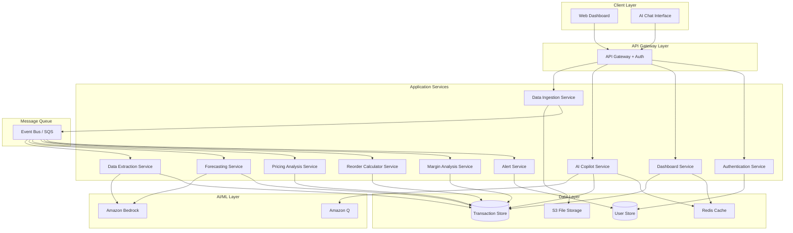

# Design Document: VyapaarIQ

## Overview

VyapaarIQ is a cloud-native, microservices-based retail intelligence platform that transforms raw sales data into actionable business insights for Indian MSMEs. The platform leverages Amazon Bedrock for AI/ML capabilities and Amazon Q for conversational intelligence, providing retailers with demand forecasting, pricing optimization, inventory management, and margin analysis through an intuitive dashboard and natural language interface.

The architecture follows a modular design with independent microservices for data ingestion, extraction, storage, analytics, and user interaction. This enables independent scaling, deployment, and maintenance of each component while maintaining system reliability through service isolation and fault tolerance.

## Architecture

### High-Level Architecture



### Architectural Patterns

1. **Microservices Architecture**: Each business capability is implemented as an independent service
2. **Event-Driven Communication**: Services communicate asynchronously via event bus for non-critical operations
3. **API Gateway Pattern**: Single entry point for all client requests with authentication and routing
4. **CQRS (Command Query Responsibility Segregation)**: Separate read and write paths for optimal performance
5. **Cache-Aside Pattern**: Frequently accessed data cached in Redis to reduce database load

### Technology Stack

- **Frontend**: React.js with TypeScript, Tailwind CSS
- **API Gateway**: AWS API Gateway with Lambda authorizers
- **Backend Services**: Node.js with TypeScript (for I/O-bound services), Python (for ML/analytics services)
- **AI/ML**: Amazon Bedrock (Claude 3 for extraction, forecasting), Amazon Q (conversational AI)
- **Databases**: Amazon DynamoDB (transaction store), Amazon RDS PostgreSQL (user store)
- **Caching**: Amazon ElastiCache (Redis)
- **Storage**: Amazon S3 (file uploads)
- **Messaging**: Amazon SQS + EventBridge
- **Authentication**: AWS Cognito
- **Deployment**: AWS Lambda (serverless functions), ECS Fargate (containerized services)

## Components and Interfaces

### 1. Data Ingestion Service

**Responsibility**: Accept and validate file uploads from users

**API Endpoints**:
```typescript
POST /api/v1/upload/csv
  Request: multipart/form-data with CSV file
  Response: { uploadId: string, status: 'pending' | 'processing', fileSize: number }

POST /api/v1/upload/pdf
  Request: multipart/form-data with PDF file(s)
  Response: { uploadId: string, status: 'pending' | 'processing', fileCount: number }

GET /api/v1/upload/{uploadId}/status
  Response: { uploadId: string, status: string, progress: number, error?: string }
```

**Implementation Details**:
- Validates file size (max 50MB per file)
- Validates file format using MIME type and magic number detection
- Stores uploaded files in S3 with user-scoped prefixes
- Publishes `FileUploadedEvent` to event bus with metadata
- Returns upload ID for status tracking

**Events Published**:
- `FileUploadedEvent`: { uploadId, userId, fileType, s3Key, timestamp }

### 2. Data Extraction Service

**Responsibility**: Extract structured sales data from uploaded files

**Event Handlers**:
- Listens for `FileUploadedEvent`
- Processes files based on type (CSV or PDF)

**Implementation Details**:

**CSV Processing**:
```typescript
interface CSVParser {
  parse(s3Key: string): Promise<RawTransaction[]>
  validateSchema(headers: string[]): boolean
  mapToStandardSchema(row: any): Transaction
}
```

**PDF Processing** (using Amazon Bedrock):
```typescript
interface PDFExtractor {
  extractText(s3Key: string): Promise<string>
  extractStructuredData(text: string): Promise<RawTransaction[]>
  // Uses Bedrock Claude 3 with prompt engineering for invoice parsing
}
```

**Bedrock Integration**:
```python
# Prompt template for invoice extraction
EXTRACTION_PROMPT = """
Extract sales transaction data from the following invoice text.
Return a JSON array with these fields for each line item:
- date (ISO 8601 format)
- product_name (string)
- quantity (number)
- unit_price (number)
- total_amount (number)
- category (string, if identifiable)

Invoice text:
{invoice_text}

Return only valid JSON, no additional text.
"""

def extract_with_bedrock(invoice_text: str) -> List[Dict]:
    response = bedrock_client.invoke_model(
        modelId="anthropic.claude-3-sonnet-20240229-v1:0",
        body=json.dumps({
            "anthropic_version": "bedrock-2023-05-31",
            "max_tokens": 4096,
            "messages": [{
                "role": "user",
                "content": EXTRACTION_PROMPT.format(invoice_text=invoice_text)
            }]
        })
    )
    return json.loads(response['body'].read())
```

**Data Validation**:
- Validates required fields: date, product_name, quantity, unit_price
- Validates data types and ranges
- Flags incomplete records for user review

**Events Published**:
- `DataExtractedEvent`: { uploadId, userId, transactionCount, timestamp }
- `ExtractionFailedEvent`: { uploadId, userId, error, timestamp }

### 3. Transaction Store

**Responsibility**: Persist and query historical sales data

**Data Model** (DynamoDB):
```typescript
interface Transaction {
  PK: string              // USER#{userId}
  SK: string              // TXN#{timestamp}#{txnId}
  userId: string
  transactionId: string
  date: string            // ISO 8601
  productName: string
  productId?: string      // Normalized product identifier
  category?: string
  quantity: number
  unitPrice: number
  totalAmount: number
  costPrice?: number      // For margin calculation
  uploadId: string
  createdAt: string
  GSI1PK: string         // PRODUCT#{productId}
  GSI1SK: string         // DATE#{date}
}
```

**Indexes**:
- Primary: PK (userId), SK (timestamp + txnId)
- GSI1: Product-based queries (PK: productId, SK: date)
- GSI2: Date-range queries (PK: userId + date range, SK: productId)

**Query Patterns**:
```typescript
interface TransactionStore {
  // Write operations
  saveTransaction(txn: Transaction): Promise<void>
  saveBatch(txns: Transaction[]): Promise<void>
  
  // Read operations
  getTransactionsByUser(userId: string, startDate: string, endDate: string): Promise<Transaction[]>
  getTransactionsByProduct(productId: string, startDate: string, endDate: string): Promise<Transaction[]>
  getRecentTransactions(userId: string, limit: number): Promise<Transaction[]>
  
  // Aggregations
  getProductSalesStats(userId: string, productId: string, days: number): Promise<SalesStats>
  getTotalRevenue(userId: string, startDate: string, endDate: string): Promise<number>
}

interface SalesStats {
  productId: string
  totalQuantity: number
  totalRevenue: number
  averagePrice: number
  transactionCount: number
  firstSaleDate: string
  lastSaleDate: string
}
```

**Performance Optimizations**:
- Batch writes for bulk imports
- Connection pooling
- Read replicas for analytics queries
- TTL for old data archival (optional)

### 4. Forecasting Service

**Responsibility**: Generate demand predictions using ML models

**Event Handlers**:
- Listens for `DataExtractedEvent`
- Triggers forecast generation for affected products

**Implementation** (Python with Amazon Bedrock):
```python
from typing import List, Dict
import pandas as pd
from datetime import datetime, timedelta

class ForecastingEngine:
    def __init__(self, bedrock_client):
        self.bedrock_client = bedrock_client
        self.min_data_points = 30
    
    def generate_forecast(self, user_id: str, product_id: str) -> Dict:
        # Fetch historical data
        historical_data = self.fetch_historical_sales(user_id, product_id)
        
        if len(historical_data) < self.min_data_points:
            return {"error": "Insufficient data", "min_required": self.min_data_points}
        
        # Prepare time series data
        df = self.prepare_time_series(historical_data)
        
        # Use Bedrock for forecasting
        forecast_7d = self.forecast_with_bedrock(df, horizon=7)
        forecast_14d = self.forecast_with_bedrock(df, horizon=14)
        forecast_30d = self.forecast_with_bedrock(df, horizon=30)
        
        # Detect seasonality
        seasonality = self.detect_seasonality(df)
        
        return {
            "product_id": product_id,
            "forecast_7d": forecast_7d,
            "forecast_14d": forecast_14d,
            "forecast_30d": forecast_30d,
            "seasonality": seasonality,
            "confidence_interval": self.calculate_confidence(df),
            "generated_at": datetime.utcnow().isoformat()
        }
    
    def forecast_with_bedrock(self, df: pd.DataFrame, horizon: int) -> List[Dict]:
        # Prepare prompt with historical data
        prompt = self.create_forecast_prompt(df, horizon)
        
        response = self.bedrock_client.invoke_model(
            modelId="anthropic.claude-3-sonnet-20240229-v1:0",
            body=json.dumps({
                "anthropic_version": "bedrock-2023-05-31",
                "max_tokens": 2048,
                "messages": [{
                    "role": "user",
                    "content": prompt
                }]
            })
        )
        
        return self.parse_forecast_response(response)
    
    def detect_seasonality(self, df: pd.DataFrame) -> Dict:
        # Simple seasonality detection using autocorrelation
        # Check for weekly (7-day) and monthly (30-day) patterns
        pass
    
    def calculate_confidence(self, df: pd.DataFrame) -> Dict:
        # Calculate confidence intervals based on historical variance
        pass
```

**API Endpoints**:
```typescript
GET /api/v1/forecast/{productId}
  Query params: horizon=7|14|30
  Response: ForecastResult

POST /api/v1/forecast/bulk
  Request: { productIds: string[] }
  Response: { forecasts: ForecastResult[] }
```

### 5. Pricing Analysis Service

**Responsibility**: Detect pricing anomalies and generate insights

**Implementation**:
```typescript
interface PricingAnalyzer {
  detectAnomalies(userId: string, productId: string): Promise<PricingAnomaly[]>
  analyzePriceSensitivity(userId: string, productId: string): Promise<PriceSensitivity>
  recommendPriceRange(userId: string, productId: string): Promise<PriceRecommendation>
}

interface PricingAnomaly {
  transactionId: string
  productId: string
  date: string
  actualPrice: number
  medianPrice: number
  deviation: number        // Percentage deviation
  potentialImpact: number  // Revenue impact in currency
  type: 'overpriced' | 'underpriced'
}

interface PriceSensitivity {
  productId: string
  elasticity: number       // Price elasticity of demand
  optimalPricePoint: number
  volumeImpact: {
    priceIncrease10Percent: number  // Expected volume change
    priceDecrease10Percent: number
  }
}

interface PriceRecommendation {
  productId: string
  currentAveragePrice: number
  recommendedMin: number
  recommendedMax: number
  recommendedOptimal: number
  reasoning: string
}
```

**Algorithm**:
1. Calculate median price for each product over rolling 30-day window
2. Flag transactions with >15% deviation from median
3. Analyze correlation between price changes and volume changes
4. Calculate price elasticity using regression
5. Recommend optimal price based on profit maximization

### 6. Reorder Calculator Service

**Responsibility**: Calculate optimal reorder points and quantities

**Implementation**:
```typescript
interface ReorderCalculator {
  calculateReorderPoint(userId: string, productId: string): Promise<ReorderPoint>
  calculateOptimalQuantity(userId: string, productId: string): Promise<number>
}

interface ReorderPoint {
  productId: string
  reorderPoint: number      // Units
  optimalOrderQuantity: number
  safetyStock: number
  leadTimeDays: number
  averageDailyDemand: number
  demandVariability: number
  estimatedStockoutRisk: number  // Percentage
}
```

**Algorithm** (Economic Order Quantity with safety stock):
```
Average Daily Demand = Total Demand / Number of Days
Demand Std Dev = Standard deviation of daily demand
Lead Time = User-configured or default 7 days

Safety Stock = Z-score * Demand Std Dev * sqrt(Lead Time)
Reorder Point = (Average Daily Demand * Lead Time) + Safety Stock

EOQ = sqrt((2 * Annual Demand * Order Cost) / Holding Cost)
```

### 7. Margin Analysis Service

**Responsibility**: Identify profit leakage and margin opportunities

**Implementation**:
```typescript
interface MarginAnalyzer {
  calculateMargins(userId: string): Promise<MarginReport>
  identifyLeakage(userId: string): Promise<LeakageReport[]>
  getRecommendations(userId: string): Promise<MarginRecommendation[]>
}

interface MarginReport {
  overallMargin: number           // Percentage
  marginByProduct: ProductMargin[]
  marginByCategory: CategoryMargin[]
  marginTrend: TrendData[]
}

interface ProductMargin {
  productId: string
  productName: string
  averageSellingPrice: number
  averageCostPrice: number
  margin: number                  // Percentage
  totalProfit: number
  volumeSold: number
}

interface LeakageReport {
  type: 'pricing_error' | 'waste' | 'theft' | 'discount_abuse'
  productId: string
  estimatedLoss: number
  occurrences: number
  description: string
  confidence: number              // 0-1
}

interface MarginRecommendation {
  productId: string
  currentMargin: number
  targetMargin: number
  action: string
  expectedImpact: number
  priority: 'high' | 'medium' | 'low'
}
```

**Detection Logic**:
- Compare actual margins to target margins (user-configured or industry standard)
- Identify products consistently sold below cost
- Detect unusual discount patterns
- Flag inventory shrinkage (expected vs actual stock)

### 8. AI Copilot Service

**Responsibility**: Process natural language queries and provide intelligent responses

**Implementation** (Amazon Q Integration):
```typescript
interface AICopilot {
  processQuery(userId: string, query: string, language: 'en' | 'hi'): Promise<CopilotResponse>
  maintainContext(sessionId: string, query: string, response: string): Promise<void>
}

interface CopilotResponse {
  answer: string
  dataPoints: DataPoint[]
  visualizations?: Visualization[]
  followUpQuestions?: string[]
  responseTime: number
}

interface DataPoint {
  metric: string
  value: number | string
  context: string
}
```

**Amazon Q Integration**:
```python
import boto3
from typing import Dict, List

class AICopilotService:
    def __init__(self):
        self.q_client = boto3.client('q')
        self.bedrock_client = boto3.client('bedrock-runtime')
    
    async def process_query(self, user_id: str, query: str, language: str) -> Dict:
        # Step 1: Translate if needed
        if language == 'hi':
            query_en = await self.translate_to_english(query)
        else:
            query_en = query
        
        # Step 2: Extract intent and entities
        intent = await self.extract_intent(query_en)
        
        # Step 3: Fetch relevant business data
        context_data = await self.fetch_business_context(user_id, intent)
        
        # Step 4: Query Amazon Q with context
        q_response = await self.query_amazon_q(query_en, context_data)
        
        # Step 5: Translate response if needed
        if language == 'hi':
            answer = await self.translate_to_hindi(q_response['answer'])
        else:
            answer = q_response['answer']
        
        return {
            "answer": answer,
            "data_points": q_response.get('data_points', []),
            "response_time": q_response['response_time']
        }
    
    async def query_amazon_q(self, query: str, context: Dict) -> Dict:
        # Configure Amazon Q with business context
        response = self.q_client.chat_sync(
            applicationId=os.environ['Q_APPLICATION_ID'],
            userMessage=query,
            conversationId=context.get('conversation_id'),
            attachments=[{
                'name': 'business_data',
                'data': json.dumps(context['data'])
            }]
        )
        
        return {
            "answer": response['systemMessage'],
            "data_points": self.extract_data_points(response),
            "response_time": response['responseTime']
        }
    
    async def fetch_business_context(self, user_id: str, intent: Dict) -> Dict:
        # Fetch relevant data based on query intent
        if intent['type'] == 'revenue_query':
            return await self.get_revenue_data(user_id, intent['time_period'])
        elif intent['type'] == 'product_query':
            return await self.get_product_data(user_id, intent['product_id'])
        elif intent['type'] == 'forecast_query':
            return await self.get_forecast_data(user_id, intent['product_id'])
        # ... more intent handlers
```

**Supported Query Types**:
- Revenue and sales queries: "What was my revenue last month?"
- Product performance: "Which products are selling best?"
- Inventory queries: "When should I reorder Product X?"
- Margin analysis: "Where am I losing profit?"
- Forecasting: "What will be the demand for Product Y next week?"
- Comparative analysis: "How does this month compare to last month?"

### 9. Dashboard Service

**Responsibility**: Aggregate and serve KPI data for visualization

**API Endpoints**:
```typescript
GET /api/v1/dashboard/kpis
  Query params: startDate, endDate
  Response: DashboardKPIs

GET /api/v1/dashboard/trends
  Query params: metric, period
  Response: TrendData[]

GET /api/v1/dashboard/top-products
  Query params: limit, sortBy
  Response: ProductPerformance[]
```

**Data Model**:
```typescript
interface DashboardKPIs {
  totalRevenue: number
  revenueChange: number          // Percentage vs previous period
  profitMargin: number
  marginChange: number
  inventoryTurnover: number
  turnoverChange: number
  topSellingProducts: ProductSummary[]
  alerts: Alert[]
  lastUpdated: string
}

interface ProductSummary {
  productId: string
  productName: string
  revenue: number
  unitsSold: number
  margin: number
}

interface TrendData {
  date: string
  value: number
  metric: string
}
```

**Caching Strategy**:
- Cache KPIs in Redis with 5-minute TTL
- Invalidate cache on new data ingestion
- Pre-compute daily aggregates for historical data

### 10. Alert Service

**Responsibility**: Generate and deliver notifications for critical events

**Event Handlers**:
- Listens for `PricingAnomalyDetected`
- Listens for `ReorderPointReached`
- Listens for `MarginLeakageDetected`

**Implementation**:
```typescript
interface AlertService {
  generateAlert(alert: Alert): Promise<void>
  sendNotification(userId: string, alert: Alert): Promise<void>
  getUserPreferences(userId: string): Promise<NotificationPreferences>
}

interface Alert {
  alertId: string
  userId: string
  type: 'pricing' | 'inventory' | 'margin'
  severity: 'high' | 'medium' | 'low'
  title: string
  message: string
  actionable: boolean
  recommendations: string[]
  createdAt: string
}

interface NotificationPreferences {
  email: boolean
  inApp: boolean
  emailAddress?: string
  alertTypes: string[]
}
```

**Notification Channels**:
- In-app notifications (stored in database, displayed in UI)
- Email notifications (via Amazon SES)
- Future: SMS, WhatsApp integration

### 11. Authentication Service

**Responsibility**: Manage user authentication and authorization

**Implementation** (AWS Cognito):
```typescript
interface AuthService {
  signUp(email: string, password: string, name: string): Promise<SignUpResult>
  signIn(email: string, password: string): Promise<AuthTokens>
  refreshToken(refreshToken: string): Promise<AuthTokens>
  signOut(userId: string): Promise<void>
  verifyToken(accessToken: string): Promise<UserClaims>
}

interface AuthTokens {
  accessToken: string
  refreshToken: string
  idToken: string
  expiresIn: number
}

interface UserClaims {
  userId: string
  email: string
  name: string
  role: 'user' | 'admin'
  permissions: string[]
}
```

**Security Features**:
- Password requirements: min 8 characters, uppercase, lowercase, number, special char
- JWT tokens with 1-hour expiration
- Refresh tokens with 30-day expiration
- Rate limiting on authentication endpoints
- Account lockout after 5 failed attempts

## Data Models

### Transaction Schema
```typescript
interface Transaction {
  transactionId: string
  userId: string
  date: string              // ISO 8601
  productName: string
  productId: string         // Normalized identifier
  category?: string
  quantity: number
  unitPrice: number
  totalAmount: number
  costPrice?: number
  uploadId: string
  source: 'csv' | 'pdf'
  createdAt: string
  updatedAt: string
}
```

### User Schema
```typescript
interface User {
  userId: string
  email: string
  name: string
  businessName?: string
  phone?: string
  language: 'en' | 'hi'
  role: 'user' | 'admin'
  createdAt: string
  lastLoginAt: string
  preferences: UserPreferences
}

interface UserPreferences {
  currency: string
  timezone: string
  notifications: NotificationPreferences
  targetMargin?: number
  defaultLeadTime?: number
}
```

### Forecast Schema
```typescript
interface Forecast {
  forecastId: string
  userId: string
  productId: string
  horizon: 7 | 14 | 30
  predictions: DailyPrediction[]
  seasonality: SeasonalityInfo
  confidenceInterval: ConfidenceInterval
  generatedAt: string
  accuracy?: number         // Calculated after actual data available
}

interface DailyPrediction {
  date: string
  predictedDemand: number
  lowerBound: number
  upperBound: number
}

interface SeasonalityInfo {
  hasSeasonality: boolean
  period?: number           // Days
  strength?: number         // 0-1
}

interface ConfidenceInterval {
  level: number             // e.g., 0.95 for 95%
  method: string
}
```

### Alert Schema
```typescript
interface Alert {
  alertId: string
  userId: string
  type: 'pricing' | 'inventory' | 'margin'
  severity: 'high' | 'medium' | 'low'
  title: string
  message: string
  details: Record<string, any>
  recommendations: string[]
  status: 'new' | 'read' | 'dismissed' | 'acted_upon'
  createdAt: string
  readAt?: string
  dismissedAt?: string
}
```


## Correctness Properties

*A property is a characteristic or behavior that should hold true across all valid executions of a system—essentially, a formal statement about what the system should do. Properties serve as the bridge between human-readable specifications and machine-verifiable correctness guarantees.*

### Property 1: File Upload Size Validation

*For any* file upload request, files under 50MB should be accepted and files over 50MB should be rejected with a descriptive error message.

**Validates: Requirements 1.1, 1.4**

### Property 2: Multi-File Upload Support

*For any* collection of valid PDF files, the Data Ingestion Service should accept all files in a single upload session and return a confirmation with upload identifiers for each.

**Validates: Requirements 1.2, 1.5**

### Property 3: File Format Validation

*For any* uploaded file, the Data Ingestion Service should validate the format before processing, accepting only CSV and PDF formats and rejecting others with descriptive error messages.

**Validates: Requirements 1.3, 1.4**

### Property 4: CSV Parsing Completeness

*For any* valid CSV file with transaction data, the Data Extraction Engine should extract all transaction records with all fields present in the CSV.

**Validates: Requirements 2.1**

### Property 5: PDF Extraction Completeness

*For any* invoice PDF, the Data Extraction Engine should extract structured data containing all required fields (date, product name, quantity, price, total amount).

**Validates: Requirements 2.2**

### Property 6: Required Field Validation

*For any* extracted transaction data, records missing required fields (date, product, quantity, price) should be flagged as incomplete and trigger user notification.

**Validates: Requirements 2.3, 2.4**

### Property 7: Data Schema Transformation Round-Trip

*For any* valid transaction data extracted from files, the data should conform to the standardized schema with all required fields properly typed and formatted.

**Validates: Requirements 2.5**

### Property 8: Transaction Persistence with User Association

*For any* validated transaction, storing it should result in the transaction being retrievable with the correct timestamp and associated with the authenticated user account.

**Validates: Requirements 3.1, 3.2**

### Property 9: Duplicate Transaction Prevention (Idempotence)

*For any* transaction, storing it multiple times should result in only one entry in the Transaction Store, maintaining data integrity.

**Validates: Requirements 3.3**

### Property 10: Forecast Generation with Sufficient Data

*For any* product with at least 30 days of historical sales data, the Forecasting Engine should generate demand predictions for that product.

**Validates: Requirements 4.1**

### Property 11: Forecast Output Completeness

*For any* generated forecast, it should include predictions for all three time horizons (7-day, 14-day, 30-day) and confidence intervals for each prediction.

**Validates: Requirements 4.3, 4.5**

### Property 12: Seasonality Detection and Incorporation

*For any* historical sales data with detectable seasonal patterns (e.g., weekly or monthly cycles), the generated forecast should reflect those patterns in the predictions.

**Validates: Requirements 4.4**

### Property 13: Price Anomaly Detection with Threshold

*For any* product's transaction history, prices deviating more than 15% from the median price should be flagged as anomalies with calculated revenue impact.

**Validates: Requirements 5.1, 5.2, 5.4**

### Property 14: Price Sensitivity Analysis

*For any* product with sufficient price variation history, the Pricing Analyzer should generate price sensitivity insights correlating price changes with volume changes.

**Validates: Requirements 5.3**

### Property 15: Price Recommendation Generation

*For any* product with historical sales data, the Pricing Analyzer should provide recommended price ranges based on sales performance.

**Validates: Requirements 5.5**

### Property 16: Reorder Point Calculation

*For any* product with tracked inventory and demand history, the Reorder Calculator should determine an optimal reorder point considering demand forecasts, lead times, and safety stock.

**Validates: Requirements 6.1, 6.2**

### Property 17: Inventory Cost Optimization

*For any* product, the suggested reorder quantity should follow economic order quantity principles to minimize total inventory costs (ordering costs + holding costs).

**Validates: Requirements 6.3**

### Property 18: Adaptive Safety Stock

*For any* product with high demand volatility (high standard deviation in daily demand), the calculated safety stock should be higher than for products with low volatility.

**Validates: Requirements 6.4**

### Property 19: Reorder Recommendation Triggering

*For any* product whose current inventory level reaches or falls below its reorder point, a reorder recommendation should be generated.

**Validates: Requirements 6.5**

### Property 20: Margin Calculation Accuracy

*For any* transaction with both selling price and cost price, the calculated margin should equal ((selling price - cost price) / selling price) * 100.

**Validates: Requirements 7.1**

### Property 21: Low Margin Identification

*For any* set of products with calculated margins, products with margins below the target threshold should be identified and flagged.

**Validates: Requirements 7.2**

### Property 22: Margin Leakage Pattern Detection

*For any* transaction history, patterns indicating waste, theft, or pricing errors (e.g., consistent below-cost sales, inventory shrinkage) should be detected and quantified.

**Validates: Requirements 7.3, 7.4**

### Property 23: Margin Improvement Recommendations

*For any* identified margin leakage, the Margin Analyzer should provide actionable recommendations to improve margins.

**Validates: Requirements 7.5**

### Property 24: AI Copilot Data Integration

*For any* user query processed by the AI Copilot, the response should include data points retrieved from the user's actual transaction history in the Transaction Store.

**Validates: Requirements 8.2**

### Property 25: AI Copilot Data-Backed Responses

*For any* answerable query, the AI Copilot response should contain specific numerical data points and insights derived from business data.

**Validates: Requirements 8.4**

### Property 26: AI Copilot Insufficient Data Handling

*For any* query that cannot be answered with available data, the AI Copilot should explain what additional data is needed rather than providing speculative answers.

**Validates: Requirements 8.5**

### Property 27: Dashboard KPI Completeness

*For any* dashboard request, the response should include all required KPIs: total revenue, profit margin, inventory turnover, and top-selling products.

**Validates: Requirements 9.1**

### Property 28: Dashboard Real-Time Updates

*For any* new transaction added to the system, querying the dashboard after the transaction is processed should reflect the updated KPIs incorporating that transaction.

**Validates: Requirements 9.2**

### Property 29: Dashboard Trend Indicators

*For any* KPI with historical comparison data, the dashboard should display trend indicators (positive/negative/neutral) correctly reflecting the change from the previous period.

**Validates: Requirements 9.3**

### Property 30: Dashboard Drill-Down Capability

*For any* displayed KPI, drill-down endpoints should exist and return detailed underlying data supporting that KPI value.

**Validates: Requirements 9.4**

### Property 31: Alert Generation for Anomalies

*For any* detected anomaly (pricing, inventory reorder point, or margin leakage exceeding thresholds), an alert should be generated for the affected user with relevant details and recommendations.

**Validates: Requirements 10.1, 10.2, 10.3, 10.5**

### Property 32: Multi-Channel Alert Delivery

*For any* generated alert, it should be deliverable through all configured notification channels (in-app, email) based on user preferences.

**Validates: Requirements 10.4**

### Property 33: Authentication Enforcement

*For any* protected platform endpoint, requests without valid credentials should be rejected, and requests with valid credentials should receive a session token with expiration.

**Validates: Requirements 11.1, 11.3**

### Property 34: Password Strength Validation

*For any* password submitted during registration, passwords not meeting strength requirements (min 8 chars, uppercase, lowercase, number, special char) should be rejected.

**Validates: Requirements 11.2**

### Property 35: Role-Based Access Control

*For any* user with a specific role, access to resources should be granted or denied based on the permissions associated with that role.

**Validates: Requirements 11.4**

### Property 36: Session Expiration Enforcement

*For any* expired session token, requests using that token should be rejected and require re-authentication.

**Validates: Requirements 11.5**

### Property 37: Multi-Language UI Support

*For any* UI element in the platform, text should be available in both Hindi and English, and switching languages should update all elements.

**Validates: Requirements 12.1, 12.4**

### Property 38: Language Preference Persistence (Round-Trip)

*For any* user who sets a language preference, logging out and logging back in should preserve that language preference.

**Validates: Requirements 12.2**

### Property 39: Multi-Language Query Processing

*For any* query submitted to the AI Copilot in either Hindi or English, the system should process it and respond in the same language.

**Validates: Requirements 12.3**

### Property 40: API Versioning Compliance

*For any* inter-service API call, the request should include a version identifier, and the API should respond according to the specified version's contract.

**Validates: Requirements 14.2**

### Property 41: Service Fault Isolation

*For any* microservice failure, other services should continue operating normally, demonstrating fault isolation.

**Validates: Requirements 14.4**

### Property 42: Bedrock API Retry Logic

*For any* failed Amazon Bedrock API call, the system should retry with exponential backoff up to a maximum number of attempts before returning an error.

**Validates: Requirements 15.5**

### Property 43: AI Response Data Grounding

*For any* response generated by Amazon Q through the AI Copilot, the response should reference actual data points from the user's business data, not hallucinated information.

**Validates: Requirements 16.4**

### Property 44: Conversation Context Preservation

*For any* sequence of related queries in a conversation session, later queries should be answered with awareness of earlier queries and responses in that session.

**Validates: Requirements 16.5**

## Error Handling

### Error Categories

1. **Client Errors (4xx)**
   - Invalid input data
   - Authentication failures
   - Authorization failures
   - Resource not found
   - Rate limiting exceeded

2. **Server Errors (5xx)**
   - Service unavailable
   - Database connection failures
   - External API failures (Bedrock, Q)
   - Timeout errors
   - Internal processing errors

### Error Response Format

All errors should follow a consistent format:

```typescript
interface ErrorResponse {
  error: {
    code: string              // Machine-readable error code
    message: string           // Human-readable error message
    details?: any            // Additional error context
    requestId: string        // For tracing
    timestamp: string
  }
}
```

### Error Handling Strategies

**Data Ingestion Service**:
- File size exceeded → Return 413 with clear message about 50MB limit
- Invalid format → Return 400 with list of supported formats
- S3 upload failure → Retry 3 times, then return 503

**Data Extraction Service**:
- Bedrock API failure → Retry with exponential backoff (1s, 2s, 4s)
- Parsing failure → Flag record as incomplete, continue processing others
- Missing required fields → Return partial results with warnings

**Forecasting Service**:
- Insufficient data → Return 400 with message about 30-day minimum
- Bedrock timeout → Return 504 with retry suggestion
- Model error → Log error, return last successful forecast if available

**AI Copilot Service**:
- Amazon Q unavailable → Return 503 with fallback message
- Query timeout → Return 504 after 3 seconds
- Ambiguous query → Ask clarifying questions
- No data available → Explain what data is needed

**Transaction Store**:
- Connection pool exhausted → Queue request, return 503 if queue full
- Query timeout → Return 504 after 2 seconds
- Duplicate key → Silently ignore (idempotent)

**Authentication Service**:
- Invalid credentials → Return 401 after rate limit check
- Expired token → Return 401 with refresh token hint
- Account locked → Return 403 with unlock instructions

### Retry Policies

**Exponential Backoff**:
```typescript
function calculateBackoff(attempt: number): number {
  const baseDelay = 1000; // 1 second
  const maxDelay = 32000; // 32 seconds
  const delay = Math.min(baseDelay * Math.pow(2, attempt), maxDelay);
  // Add jitter to prevent thundering herd
  return delay + Math.random() * 1000;
}
```

**Retry Conditions**:
- Network errors: Retry up to 3 times
- 5xx errors: Retry up to 3 times
- 429 (rate limit): Retry with backoff from Retry-After header
- 4xx errors (except 429): Do not retry

### Circuit Breaker Pattern

For external service calls (Bedrock, Q):
- Open circuit after 5 consecutive failures
- Half-open after 30 seconds
- Close circuit after 2 successful requests
- Return cached data or degraded functionality when circuit is open

## Testing Strategy

### Dual Testing Approach

VyapaarIQ requires both unit testing and property-based testing for comprehensive coverage:

**Unit Tests**: Focus on specific examples, edge cases, and integration points
- Specific CSV parsing examples with known data
- Edge cases like empty files, malformed data
- Authentication flows with specific credentials
- Error conditions with specific invalid inputs
- Integration between services

**Property-Based Tests**: Verify universal properties across all inputs
- File upload validation across random file sizes
- Data extraction across randomly generated transactions
- Forecast generation across various historical data patterns
- Pricing anomaly detection across random price distributions
- All correctness properties defined above

### Property-Based Testing Configuration

**Framework Selection**:
- **TypeScript/JavaScript services**: fast-check
- **Python services**: Hypothesis

**Test Configuration**:
- Minimum 100 iterations per property test
- Each test tagged with: **Feature: vyapaariq, Property {number}: {property_text}**
- Seed-based reproducibility for failed tests
- Shrinking enabled to find minimal failing examples

**Example Property Test Structure** (TypeScript with fast-check):
```typescript
import fc from 'fast-check';

describe('Feature: vyapaariq, Property 1: File Upload Size Validation', () => {
  it('should accept files under 50MB and reject files over 50MB', async () => {
    await fc.assert(
      fc.asyncProperty(
        fc.record({
          fileName: fc.string({ minLength: 1, maxLength: 100 }),
          fileSize: fc.integer({ min: 0, max: 100_000_000 }), // 0-100MB
          content: fc.uint8Array({ minLength: 0, maxLength: 1000 })
        }),
        async (file) => {
          const result = await dataIngestionService.uploadFile(file);
          
          if (file.fileSize <= 50_000_000) {
            // Should accept
            expect(result.status).toBe('accepted');
            expect(result.uploadId).toBeDefined();
          } else {
            // Should reject
            expect(result.status).toBe('rejected');
            expect(result.error).toContain('50MB');
          }
        }
      ),
      { numRuns: 100 }
    );
  });
});
```

**Example Property Test Structure** (Python with Hypothesis):
```python
from hypothesis import given, strategies as st
import pytest

# Feature: vyapaariq, Property 20: Margin Calculation Accuracy
@given(
    selling_price=st.floats(min_value=1.0, max_value=10000.0),
    cost_price=st.floats(min_value=0.1, max_value=10000.0)
)
def test_margin_calculation_accuracy(selling_price, cost_price):
    """
    For any transaction with both selling price and cost price,
    the calculated margin should equal ((selling_price - cost_price) / selling_price) * 100
    """
    transaction = create_transaction(
        selling_price=selling_price,
        cost_price=cost_price
    )
    
    calculated_margin = margin_analyzer.calculate_margin(transaction)
    expected_margin = ((selling_price - cost_price) / selling_price) * 100
    
    assert abs(calculated_margin - expected_margin) < 0.01  # Allow for floating point precision
```

### Test Data Generators

**Transaction Generator**:
```typescript
const transactionArbitrary = fc.record({
  date: fc.date({ min: new Date('2020-01-01'), max: new Date() }),
  productName: fc.string({ minLength: 1, maxLength: 100 }),
  quantity: fc.integer({ min: 1, max: 1000 }),
  unitPrice: fc.float({ min: 0.01, max: 100000, noNaN: true }),
  costPrice: fc.option(fc.float({ min: 0.01, max: 100000, noNaN: true }))
});
```

**Historical Data Generator** (for forecasting):
```python
@st.composite
def historical_sales_data(draw, min_days=30, max_days=365):
    num_days = draw(st.integers(min_value=min_days, max_value=max_days))
    base_demand = draw(st.floats(min_value=1.0, max_value=100.0))
    seasonality = draw(st.booleans())
    
    data = []
    for day in range(num_days):
        demand = base_demand
        if seasonality:
            # Add weekly seasonality
            demand += base_demand * 0.3 * math.sin(2 * math.pi * day / 7)
        # Add noise
        demand += draw(st.floats(min_value=-base_demand*0.2, max_value=base_demand*0.2))
        data.append({
            'date': (datetime.now() - timedelta(days=num_days-day)).isoformat(),
            'quantity': max(0, demand)
        })
    return data
```

### Integration Testing

**Service Integration Tests**:
- Test data flow from ingestion → extraction → storage
- Test forecast generation triggered by new data
- Test alert generation triggered by anomaly detection
- Test dashboard updates after transaction processing

**External Service Integration**:
- Mock Amazon Bedrock responses for deterministic testing
- Mock Amazon Q responses for conversational flow testing
- Test retry logic with simulated failures
- Test circuit breaker behavior

### End-to-End Testing

**Critical User Flows**:
1. Upload CSV → View extracted transactions → See updated dashboard
2. Upload invoice PDF → Receive extraction notification → Review data
3. Ask AI question → Receive data-backed answer → Ask follow-up
4. Receive reorder alert → View recommendation → Take action
5. View pricing anomaly → Review details → Adjust pricing

### Performance Testing

**Load Testing Scenarios**:
- 1,000 concurrent users accessing dashboard
- Bulk upload of 100,000 transactions
- 100 concurrent AI queries
- Forecast generation for 10,000 products

**Performance Targets**:
- Dashboard load: < 2 seconds (p95)
- AI query response: < 3 seconds (p90)
- Transaction query: < 2 seconds for 100k records
- File upload: < 5 seconds for 50MB file

### Test Coverage Goals

- Unit test coverage: > 80% for business logic
- Property test coverage: 100% of correctness properties
- Integration test coverage: All service boundaries
- E2E test coverage: All critical user flows

### Continuous Testing

**Pre-commit**:
- Run unit tests
- Run linting and type checking

**CI Pipeline**:
- Run all unit tests
- Run property-based tests (100 iterations)
- Run integration tests
- Generate coverage reports

**Nightly**:
- Run property-based tests (1000 iterations)
- Run performance tests
- Run security scans
